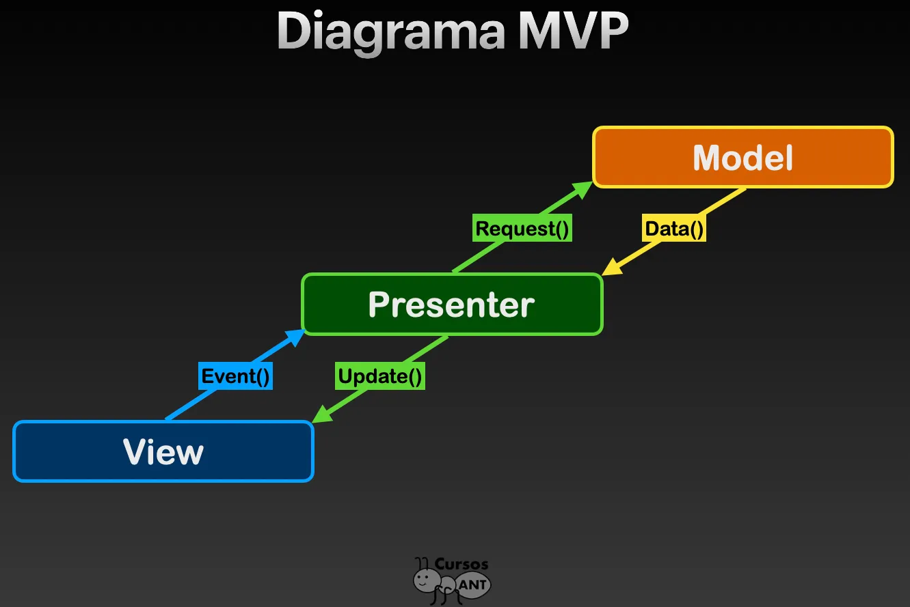
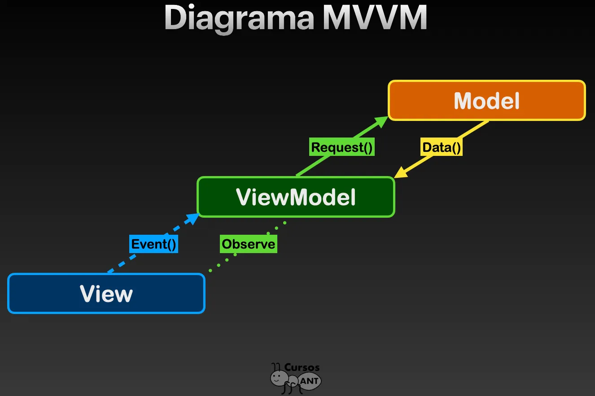
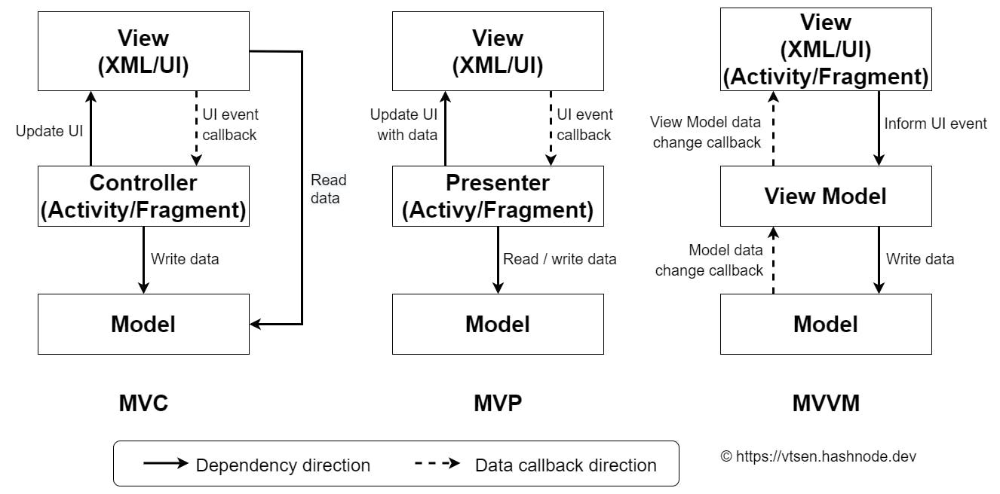
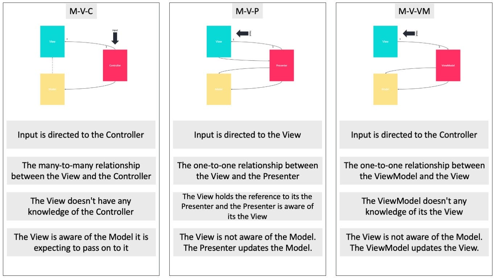
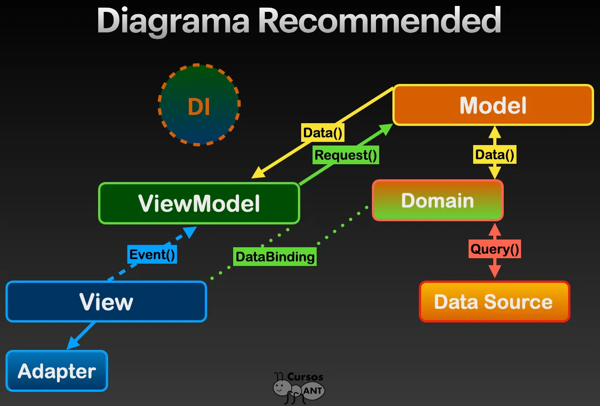

# ¿MVC en Android?

El problema que se tiene en Android, al momento de immplementar una arquitectura MVC, es que las actividades son 2 en uno, es decir, son controladores y a su vez necesitan inflar la vista para funcionar, por esta razón, si bien se puede encontrar proyectos que usen MVC, no es recomendable porque nunca se respetará su origen.

## MVP

Model View Presenter, lo curioso es que justamente mvp es la adaptación de mvc, pero para Android. Tiene la peculiaridad de centralizar la lógica en la capa del presententador, aquí se promueve que la vista no tenga lógica, que se limite a reaccionar al usuario, o al presentador, y por otro lado, el modelo gestiona los datos para dar respuesta a las solicitudes que le haga el presentador. Fue muy popular con Java, pero desde Kotlin se quedó en el olvido, porqué?

## MVVM

Model View ViewModel, con la llegada de Kotlin, Jetpack y AndroidX, se vino una revolución de nuevos elementos impulsados por Google, para formar una arquitectura para android definitiva, así nace MVVM. A simple vista, esta arquitectura puede verse similar a MVP, pero un una gran diferencia, aquí se soluciona el principio de aplicaciones reactivas, que significa eso, básicamente que la vista y ciertos flujos de código, deben simplemente reaccionar a cambios de datos o estados, el nombre de esta solución, es DataBinding. Modelo sigue teniendo el mismo concepto, pero ahora que tenemos una View reactiva, falta saber que es ViewModel, dónde esta capa trae otro par de complementos vitales, LiveData para generar variables observables, y una separación del ciclo de vida. Si quieres hacer una apuesta segura, empieza por aquí, mvvm es hoy por hoy la arquitectura que todo programador android debe saber para buscar un buen empleo.

## Diferencias

